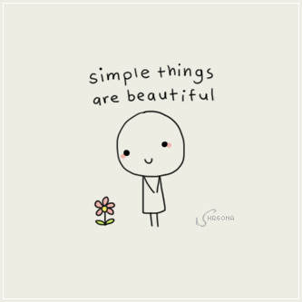

<div align="center">
<h1>useForm</h1>

  

<br />

</div>

<h1>React useForm custom hook | <a target="_blank" href="https://use-form.vercel.app/">storybook</a></h1>

<br />

To get it started, add `use-form` to your project:

```sh
yarn add @kkatkus/use-form
```

Or if you prefer using npm:

```sh
npm install @kkatkus/use-form --save
```

<br />
<h1>How to use it</h1>

```ts
useForm<T>(config: UseFormConfig<T>, options?: UseFormOptions): UseForm<T>
```

 Example:
 ```ts
interface ExampleForm extends Record<string, UseFormValue> {
  email: string;
  password: string;
  repeatPassword: string;
  age: number;
};
```

```jsx
function Example(): ReactElement {
  
  const ageValidator = (val: UseFormValue): string | null => {
    if (val === "") {
      return null;
    }

    if (Number(val) < 18) {
      return " Not 18";
    }

    return null;
  };

  const form = useForm<ExampleForm>(
    {
      email: ['test@test.com', required('Email is required'), email()],
      password: [required('Password is required'), minLength(8)],
      repeatPassword: [required('Repeat password is required'), equal<ExampleForm>('password', 'Passwords must match')],
      age: [required('Age is required'), ageValidator],
    },
    {
      validateOn: 'change',
    }
  );

  const handleSubmit = async (e: FormEvent) => {
    e.preventDefault();
    const { valid, errors } = form.submit();
    if (!valid) {
      return;
    }

    // when valid do something
    // ...
  };

  return (
    <form ref={form.ref} onSubmit={handleSubmit} method="post">
      <Input type="text" placeholder="Email address" name="email" />
      <Input type="password" placeholder="Password" name="password" />
      <Input type="password" placeholder="Repeat password" name="repeatPassword" />
      <Input type="number" placeholder="Age" name="age" />
      <button type="submit">Create my account</button>
    </form>
  );
```

<h2>Validators</h2>
<br />

- ```min(minVal: number, message: string): string | null```<br />Validator that requires the control's value to be greater than or equal to the provided number.<br /><br />
- ```max(maxVal: number, message: string): string | null```<br />Validator that requires the control's value to be less than or equal to the provided number.<br /><br />
- ```required(message: string): string | null```<br />Validator that requires the control have a non-empty value.
- ```requiredTrue(message: string): string | null```<br />Validator that requires the control's value be true. This validator is commonly used for required checkboxes.<br /><br />
- ```equal(withName: string, message: string): string | null```<br />Validator that requires the control's value to be equal with other control's value. This validator is commonly used to compare passwords.<br /><br />
- ```email(message: string): string | null```<br />Validator that requires the control's value pass an email validation test.<br /><br />
- ```minLength(minLengh: number, message: string): string | null```<br />Validator that requires the length of the control's value to be greater than or equal to the provided minimum length.<br /><br />
- ```maxLength(maxLength: number, message: string): string | null```<br />Validator that requires the length of the control's value to be less than or equal to the provided maximum length.<br /><br />
- ```pattern(pattern: string | RegExp, message: string): string | null```<br />Validator that requires the control's value to match a regex pattern.<br /><br />
- ```numeric(message: string): string | null```<br />Validator that requires the control's value pass numeric validation test.<br /><br />
- ```decimal(message: string): string | null```<br />Validator that requires the control's value pass decimal validation test.